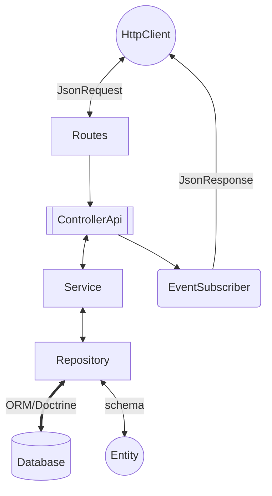
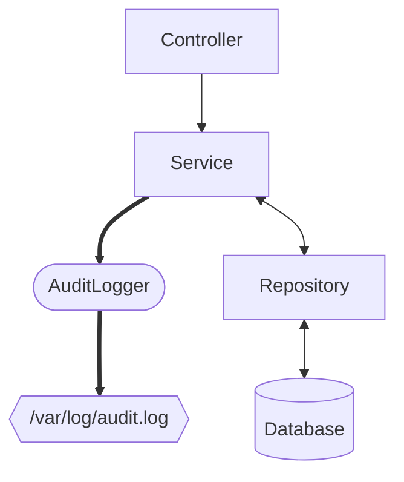

[](https://codecov.io/gh/LeadsForYou/LeadForYou-backend)


# LeadForYou

Este é um repositório padrão para desenvolvimento de aplicações usando Docker, PHP, Symfony e MySQL

## Tecnologias

- **PHP** 8.4
- **Postgres** 16
- **Symfony** 7.2

## ⚠️ Aviso Importante - Permissões de Arquivos

Após clonar o repositório, você pode enfrentar problemas de permissão para editar arquivos. **Execute estes comandos imediatamente após o clone:**

```bash
# Corrigir propriedade dos arquivos
sudo chown -R $USER:$USER .

# Dar permissões adequadas
chmod -R 755 var/ public/ docker/
```

Se não fizer isso, pode ter erros ao editar arquivos ou rodar os containers.

---

## Instalação
<details>
<summary>Passo a passo</summary>

### Clonar o Repositório

Primeiro, clone o repositório usando SSH ou HTTPS:

```bash
git clone git@github.com:alessandrofeitoza/leadx-backend.git
```
ou
```bash
git clone https://github.com/alessandrofeitoza/leadx-backend.git
```

### Navegar para o Diretório do Projeto
Mude para o diretório do projeto:

```bash
cd LeadForYou-backend
```

---
>
> O jeito mais fácil é rodar o comando `make setup`, isso já vai executar todos os passos necessários e deixar a aplicação rodando em <http://localhost:8080>
>
Mas se preferir, pode fazer o passo a passo abaixo

---

### Iniciar o Docker com seus contêineres
Precisar ter o `docker compose` instalado/configurado:
```bash
docker compose up -d
```

### Instalar Dependências (Composer)
Antes de mais nada entre no contêiner PHP:
```bash
docker compose exec -it php bash
```
**Agora é necessário executar outros passos, sequencialmente:**

1 - Instalação das dependências do PHP:
```bash
composer install
```

2 - Executar as migrations do PostGres/Doctrine
```bash
php bin/console doctrine:migrations:migrate -n
```

3 - Executar as fixtures (dados falsos para testes) do banco de dados
```bash
php bin/console doctrine:fixtures:load -n
```


### Uso

Depois que tudo estiver configurado e as dependências instaladas, você pode acessar sua aplicação Symfony em [http://localhost:8080](http://localhost:8080).

</details>

## ⚠️ Problemas de Permissões

Se você encontrar erros relacionados a permissões de arquivos após clonar o repositório, execute os seguintes comandos:

### No Linux/Mac
```bash
# Corrigir permissões dos arquivos
sudo chown -R $USER:$USER .

# Dar permissão de escrita nos diretórios necessários
chmod -R 755 var/
chmod -R 755 public/
```

### Dentro do contêiner Docker
Se os problemas persistirem após estar dentro do contêiner PHP:

```bash
# Entrar no contêiner
docker compose exec -it php bash

# Corrigir permissões
chmod -R 777 var/cache
chmod -R 777 var/log
```

### Usando `make setup`
O comando `make setup` já cuida automaticamente dessas permissões, então essa seção é necessária apenas se fizer a instalação manual.

---

## Desenvolvimento
<details>
<summary>Arquitetura e Decisões técnicas</summary>

Estamos utilizando o Symfony e o seu ecossistma de bibliotecas, porém a arquitetura é baseada em camadas e trata-se de um monolítico com a metodologia API First




#### Logs
Estamos salvando os logs de cada persistencia na base, optamos por fazer esse controle através da camada `Service`, como mostra a figura a seguir:



#### Response Headers
Através de uma camada de `EventSubscriber` estamos adicionando um custom header em cada Response

<table>
<tr>
<th colspan="2">HEADERS</th>
</tr>
<tr>
<td>X-REQUEST-INFO</td>
<td>2</td>
</tr>
</table>

</details>

